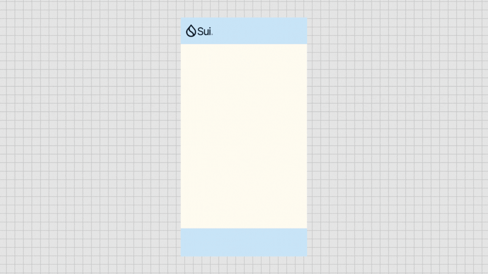

# SuiSecToolkit

**SuiSec** is a team dedicated to the security of the [Sui](https://sui.io) ecosystem, having developed a suite of security plugins.

## [SuiSecBlockList](https://github.com/RandyPen/SuiSecBlockList)

Capable of identifying malicious websites and intercepting user access, as well as recognizing phishing assets, which can be either discreetly displayed within wallet applications or marked with alerts on the Explorer.

## [DryRunTransactionBlockResponsePlus](https://github.com/RandyPen/DryRunTransactionBlockResponsePlus)

The original simulated transaction information on Sui is overly complex, which may lead to users signing transactions without noticing crucial details, thus falling for scams.

This plugin will extract and present the most relevant information to the user.

## [Sui-RPC-Proxy](https://github.com/RandyPen/sui-rpc-proxy)

Assists developers in analyzing Sui transaction request information locally. This is a byproduct of our development of security tools.  

## [SUI-SCAM-DETECTION](https://github.com/RandyPen/SUI-SCAM-DETECTION)

An offline workflow, integrated with AI to detect SCAM information.
